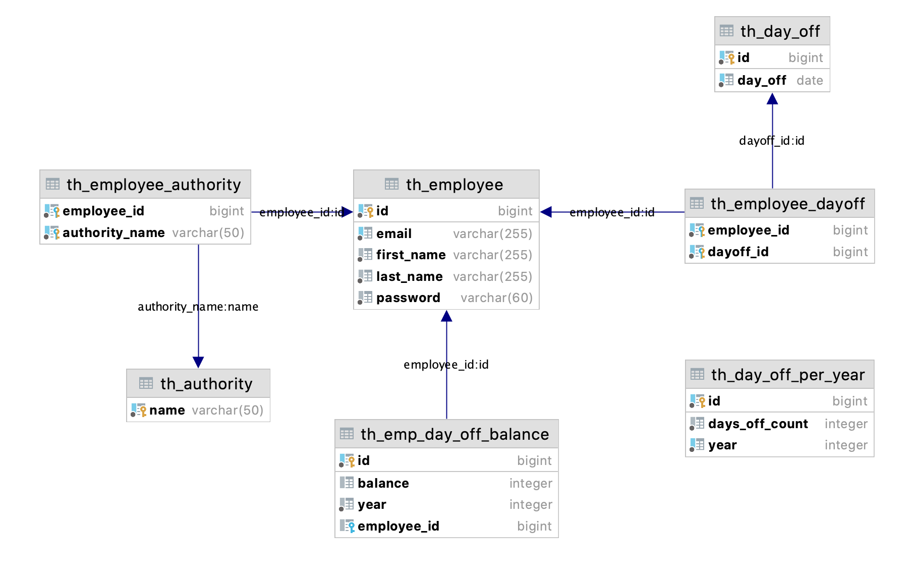

# Basic holiday service
A small project to illustrate some common features in a Spring Boot application.

Project includes:
- a domain design oriented (spring-data-jpa)
- a secured REST API to add/remove/replace/delete (spring-rest, spring-security)
- a scheduled batch that dump all employees days off (spring-batch)

## Requirements
- Install OpenJDK 11+
- Install Maven (version > 3.2)
- Install Docker (tested with version 19.03.4)

## Getting started
1/ Start a Postgresql (PG) instance
```shell
docker-compose -f docker/postgresql.yml up
```

2/ Connect to the PG instance, and create the database
```sql
CREATE DATABASE holiday;
```

3/ Start the holiday-service using maven spring-boot plugin
```shell
mvn spring-boot:run
```

When service starts, it initializes an employee model, with two default employees:

| USER                  | EMAIL                | PASSWORD    | AUTHORITY  |
|-----------------------|----------------------|-------------|------------|
| Claretta Ethridge     | c.ehtridge@aol.us    | HelloWorld! | DEVELOPER  |
| Winifred Running Goat | w.runninggoat@aol.us | HelloWorld! | CONSULTANT |

### Entity model



### TODO
#### Batch
- [ ] improve batch implementation and provide a paginating jdbc item reader
- [ ] provide an async implementation for non blocking I/O when launching batch through an API request

#### CI/CD:
- [ ] deploy service with GitHub action in a kubernetes cluster (GCP)
